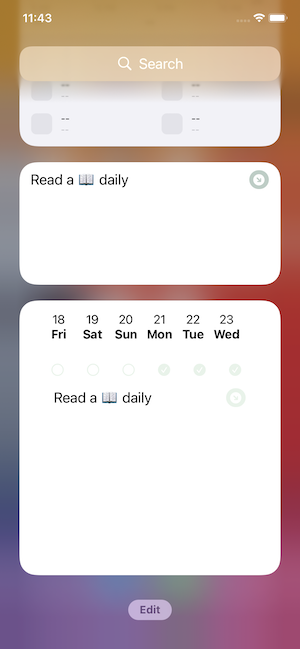

# h21-swift-ui
Habits management app. 

Allows users to create habits they want to develop, 
track progress and also set a reminder to keep focus on certain habits.

NOTE: Widgets implementation is WIP [on this branch](https://github.com/LisitaEugen/h21-swift-ui/tree/add-widget) 

 

 

 
