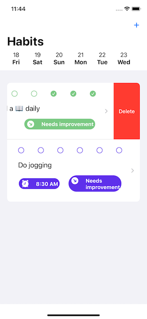
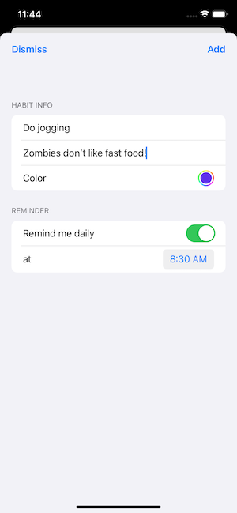
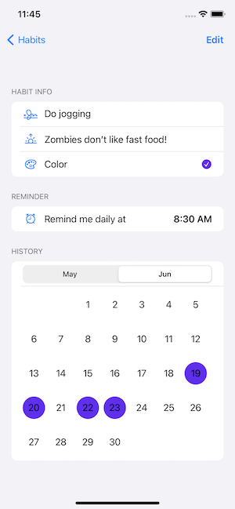
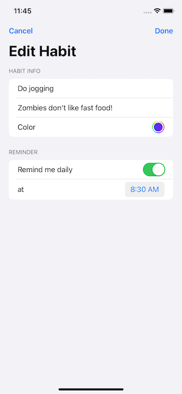
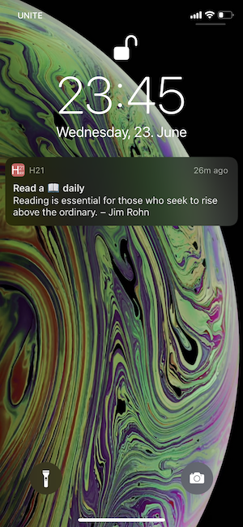
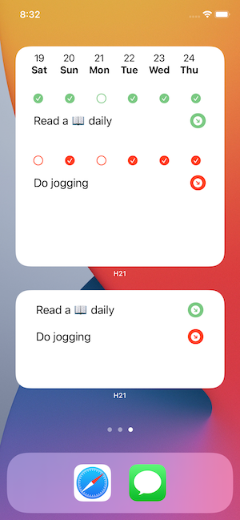
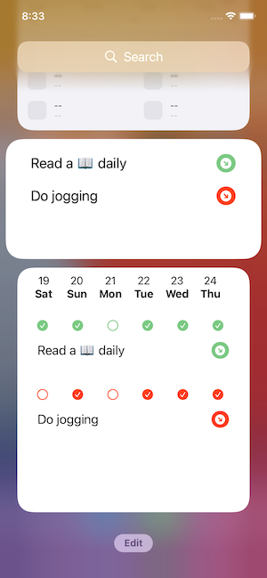

# h21-swift-ui
Habits management app. 

Allows users to:
- create/ delete habits they want to develop
- add reminder which will display a notification with motivation
- track the progress of a habit
- track up to three habits in a widget

 

 

 
 
